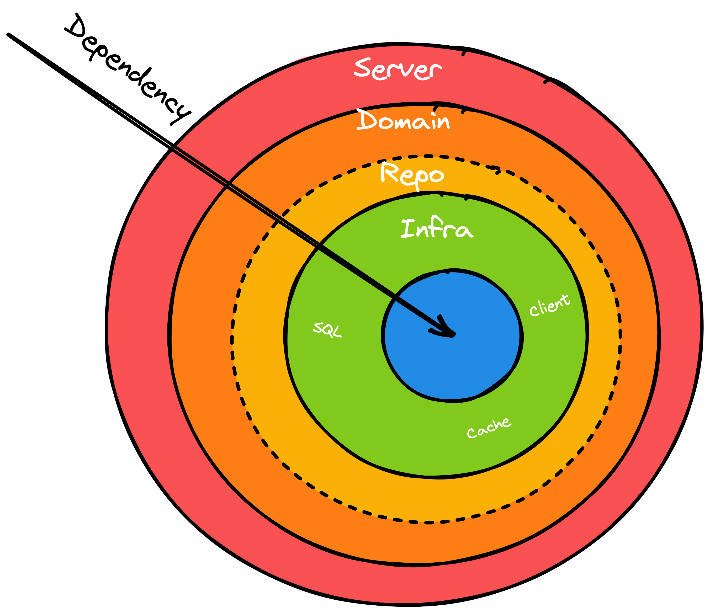

# Go 项目结构实践
[本仓库](https://github.com/yuchanns/template)采用了目前社区中较为流行的 Gin, Gorm, Dig, Go-Resty 等第三方库作为使用案例，但理论上可以结合各种具有良好设计规范的工具包使用。
## 项目组织结构概览
文件树概览，后续会对照解说，此时不需要纠结。
```sh
.
├── go.mod
├── go.sum
├── internal
│   ├── domain
│   │   ├── async
│   │   │   ├── domain.go
│   │   │   └── repo.go
│   │   └── greet
│   │       ├── domain.go
│   │       └── repo.go
│   ├── infra
│   │   ├── client
│   │   │   └── unknown.go
│   │   ├── mysql
│   │   │   ├── greet.go
│   │   │   └── models
│   │   │       └── greeter.go
│   │   └── redis
│   └── server
│       ├── async.go
│       └── greeting.go
├── main.go
├── startup
│   ├── di.go
│   ├── event.go
│   ├── route.go
│   └── vars.go
├── utils
│   ├── converter.go
│   ├── gin_wrapper.go
│   ├── goroutine.go
│   └── ioc.go
└── vars
    └── var.go
```

### 分层与单向依赖
Go 的一个特色同时也是缺陷：不支持循环引用。
> 1. 为了高速编译(主要原因)
> 2. 单向依赖逻辑简洁(大道至简)

所以我们为了避免在应用变得复杂后踩到循环引用的坑，一开始代码结构就要约定好**单边方向**，如上图**业务三层模型**。

Server 层也就是 PHP 中 Laravel 的 Controller 层，只负责获取入参、校验和调用 Domain 方法进行数据处理。

Domain 层用于编写具体而复杂的业务逻辑。
> 有的团队会把 Domain 细分成 Service 和 Domain 或者 App 和 Service 或者三者皆有。实际开发过程中发觉这样太过复杂，不需要分那么多层，所以一般取一个 Domain 层就足矣。当然，根据喜好和理解通用性叫 Service 也没什么问题。

同时可以注意到 Domain 还包含了一些以 Repo 为名字后缀的接口，这是用来定义数据交互的接口，对业务逻辑屏蔽了具体的细节和差异。 Domain 业务逻辑通过调用这些接口来与实际的数据库、缓存或者远程调用进行交互。
> 使用接口编程的好处之一是和具体实现解绑。
>
> 随着业务发展我们可能会出现将本地数据库调用拆分出去成为远程调用、觉得关系型数据库不符合业务场景需要切换成非关系型数据库等场景，这时候我们变更实现会更清晰和容易。
>
> 严谨地说，对于 Server 层和 Domain 层也应该定义接口，面向接口编程。但是这样写代码过于繁琐，最好省略。

Infra 层是基础设施层，真正进行数据交互操作的地方，实现了在 Domain 层定义的 Repo 接口。封装了所有 sql 细节、缓存交互细节和远程调用细节。
> 通常开发者在操作 mysql 数据库时可以很好的隔绝开业务代码和 sql 做到不互相侵入。但是遇到类似 mongodb 这类没有足够抽象的 orm 支持的数据库，就会出于代码复用等原因不自觉地开始把 sql 细节混入业务逻辑中，造成混乱。
> 
> 用 Infra 层可以使这种混乱具有边界。

整个调用方向是 `Server -> Domain -> Infra` ，不存在反向调用。

> 有时候我们确实会存在每个层都需要使用同一个实例的场景，例如：
> 1. 数据结构转换，入参 request 数据结构转换成 domain 层的 DTO(Data Transfer Object) 、DTO 转换成具体数据库的 DO(Data Object)。
> 2. Channel 通道，在 Domain 层投递数据，在 Server 层取数据。
> 3. 数据库实例，在 Server 层创建，在 Infra 层使用。
> 4. Domain 业务间存在相互引用的业务和代码复用关系。
> 
> 这种时候建议：
> 1. 把代码写在不属于任何一层的**第三方目录**，例如根目录的 common 、utils 等目录下。这样任一层都可以调用而不会出现循环引用编译失败。
> 2. 由上一层调用传递所需数据，如 Server 层调用第一个 Domain 将结果传递给第二个 Domain （如果前期评估业务中存在大量这种关系，可以在 Server 和 Domain 间增加一层 Service 层，避免 Server 层复杂化）。

### 目录划分与代码细节
#### 程序入口
首先，程序的入口毫无疑问是根目录的 `main.go` 文件。

> 在开源社区我们往往还可以看到有些著名项目将入口放在 cmd 文件夹中(例如 K8s)。个人认为一般的项目没有必要，入口集中在 cmd 适合一个大单体仓库里存在多个应用的场景。
>
> 在根目录直接使用 main.go 作为入口简洁明了。

入口文件的代码较为简单，主要是创建 http 实例、注册容器实例、注册全局变量、注册路由和注册事件等：
```go
package main

import (
	"github.com/yuchanns/template/startup"

	"github.com/gin-gonic/gin"
)

func main() {
	engine := gin.Default()

	// 一系列的启动时注册
	c := startup.RegisterContainer()
	startup.RegisterVars()
	startup.RegisterRoute(engine, c)
	startup.RegisterEvent(c)

	// 启动服务
	engine.Run()
}
```
这样对查看代码更友好，可以按模块追溯。
#### 注册入口
程序的启动和运行可以被进一步细分为**启动时**和**运行时**。

启动时的方法只需被调用一次，属于全局性质的代码。例如数据库连接等全局变量、路由注册等。

建议将启动时集中在 `startup` 文件夹，并将一些可复用的全局实例使用依赖注入工具注册成容器实例。同时在一个与分层无关的地方组装各层次的代码完全可以避免循环引用的错误。
```sh

├── startup
│   ├── di.go      # 依赖注入
│   ├── event.go   # 事件注册
│   ├── route.go   # 路由注册
│   └── vars.go    # 全局变量注入
```
当你需要寻找 http 请求路由时可以目标明确快速地在 `route.go` 中寻找；需要增加新的容器实例可以直接在 `di.go` 里添加；需要寻找异步事件时也可以在 `event.go`  里按图索骥。
#### 全局变量
全局变量在 `startup/vars.go` 中注入，但是声明是在根目录下的 `vars` 文件夹。这是因为全局变量需要被 `starup` 引用，同时又要被业务三层模型引用，会出现 `starup` 和业务三层模型互相引用的情况，于是就需要放在第三方目录即 `vars` 目录下。
#### 业务模型细节
业务三层模型统一放置在 `internal` 目录下。`internal` 对于 go 具有特殊意义，放置在这个目录下的代码无法被**跨包调用**，具有隐藏细节的能力。

在 `internal` 中一共分为三个子目录 `server`, `domain` 和 `infra` 分别对应上面提到的业务三层模型的代码位置。

其中请求**入参**和响应**出参**的数据结构应该与 **Server** 一并定义在 `server` 目录中，并只被 `server` 所使用，不透传到其它层。

每个 Server 应该提供一个构造函数，并且该构造函数将在启动时被 `startup` 用于注册路由或事件。

Server 的每个方法，统一返回 `(interface{}, error)` 这两个类型：前者返回最终处理后的数据，后者返回错误。
```go
func (g *GreeterSrv) SayHello(ctx *gin.Context) (interface{}, error) {
	req := RequestHello{}
	if err := ctx.ShouldBindQuery(&req); err != nil {
		return nil, err
	}
	gm, err := g.dom.SayHello(ctx, req.ID)
	if err != nil {
		return nil, err
	}
	resp := &ResponseHello{}
	err = utils.Convert(gm, &resp)
	return resp, err
}
```
显然这样的返回不符合 gin 路由的注册要求，但符合编写直觉，遇到错误直接返回错误即可。

我们在工具目录 `utils` 中封装了一个构建符合 gin 路由注册要求的函数，同时节省了对 http 进行正确和错误响应的重复代码：
```go
func BuildGinHandler(fn func(ctx *gin.Context) (interface{}, error)) gin.HandlerFunc {
	return func(ctx *gin.Context) {
		data, err := fn(ctx)
		if err != nil {
			ctx.JSON(http.StatusOK, gin.H{
				"msg":  err.Error(),
				"code": 500,
				"data": nil,
			})
			return
		}
		ctx.JSON(http.StatusOK, gin.H{
			"msg":  "success",
			"code": 0,
			"data": data,
		})
	}
}
```
在注册路由时只需用该函数对 Server 的方法做一层包装即可 `engine.GET("/greet", utils.BuildGinHandler(srv.SayHello))` 。

> 需要自定义 HTTP 响应码？
>
> 将返回值改成三个，并对包装函数做相应修改即可。
>
> 为什么返回这两个类型？
>
> 曾经试过把 Server 的方法写成实现了 `gin.HandlerFunc` 的函数类型，直接注册到 gin 的路由里。这样当然没有什么问题，但是每个方法都需要写大量的响应代码，或正确或错误，浪费时间和空间：
> 
> ```go
> func (g *GreeterSrv) SayHello(ctx *gin.Context) {
>     // ...
>     result, err := g.dom.DoSometh()
>     if err != nil {
>         ctx.JSON(http.StatusOK, gin.H{"msg": err.Error()})
>         return
>     }
>     ctx.JSON(http.StatusOK, gin.H{"data": result})
>     return
> }
> 
> ```
> 
> 重复使用 ctx.JSON ，还需要换行 return 。
> 
> 当然也可以封装类似 JSONSuccess(ctx context.Context, data interface{}) 的方法，但依然需要多写一行 return 甚至可能因为遗忘导致代码继续执行下去。

domain 目录下按不同的业务划分各自的子目录，一般在这些子目录下至少包含 `domain.go` 和 `repo.go` 两个文件，用于存放业务逻辑和数据交互接口定义。

infra 目录下按实现的类型划分子目录，例如 `mysql`, `redis` 和 `client` 。

其中 `mysql` 下还有一个 `models` 子目录，保存着适用特定 ORM 要求的数据结构也就是 **DO**，只被 `mysql` 层所使用，不透传到其他层。

从 Server 层到 Domain 层 到 Infra 层，数据的传输通过定义在 Domain 层的 **DTO** 来实现：
* Server 层负责将 **Request** 转化成 **DTO** 以及将 **DTO** 转化成 **Response** 。
* Infra 层负责 **Model** 和 **DTO** 之间的转换。

这里要注意在 Domain 层既不引用 **Request** 也不引用 **Model** ，就不会发生循环引用。

#### 工具包
我们还有一个 `utils` 目录，用于存放常用工具。事实上这些常用工具应该被封装成一个第三方库，然后每个项目都引用这个库，而不是在每个项目下重复写一遍 `utils` ，这里仅仅是出于演示需要才这么做。

常用工具包括但不限于：
* 数据结构转换工具(通常使用 json 实现)
* 安全 goroutine 构建工具( panic 日志记录，控制并发数量等)
* 依赖注入工具
* 一些中间件
#### 异步任务
我们的 Server 分为两种，一种是 http Server 另一种是 event Server ，它们分别通过 `startup/route.go` 和 `startup/event.go` 进行注册。

虽然官方说使用 goroutine 异常简单只需要原地 `go` 一个就可以，但如果你真的这么做，将会导致 goroutine 在代码中到处都是，混乱不堪。你甚至无法快速判断一个 http 请求里是不是会包含其他 goroutine ，想要限流时也会变得很麻烦。
> 比如实际开发中遇到的某个场景，用户通过触发一个路由去异步刷新日志。刷新日志之前还需要请求另一个服务获取日志的一些标识信息。刷新日志是一个持续3分钟的行为。
>
> 原本这整个逻辑被简单粗暴地用一个 `go` 处理了，结果该路由被高频调用，导致提供日志标识信息的服务被冲垮。
>
> 当时我们的应急处理方案是对 goroutine 进行限量，但是刷新日志需要持续三分钟，这样就会导致三分钟里只有少数用户可以看到日志的刷新，所以变得很棘手。后来我暂时通过细化 goroutine 的粒度去解决限流问题，这是题外话。

所以当我们需要执行异步任务时，最好在同步请求中将异步任务通过 `channel` 或者外部队列投递，然后在统一的事件入口注册这些异步任务。便于管理(比如限流)和查找。
> 在这个 example 中我使用了 ants 管理 goroutine 池。这个工具可以全局管理 goroutine 数量，也可以针对某些场景管理特定的 goroutine 数量。

## 其他规范细节
* context 实例需要透传，方便级联控制。
* 编辑器如 GoLand 等配置 `gofmt` 保存时格式化代码。 
* 错误统一使用 `github.com/pkg/errors` 包装返回，在最初发生错误的地方包装。这个库可以方便地打印出堆栈，对 debug 很有帮助。
* 待补充
